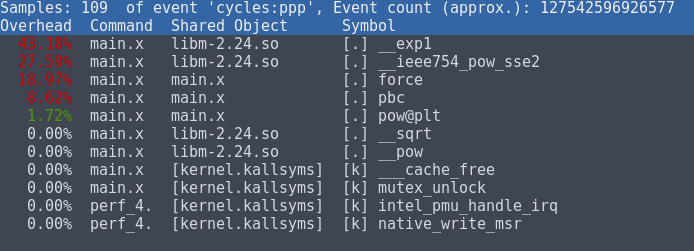
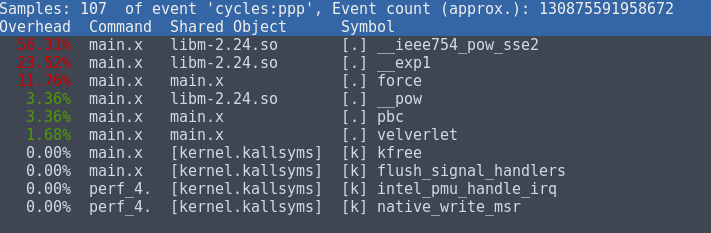
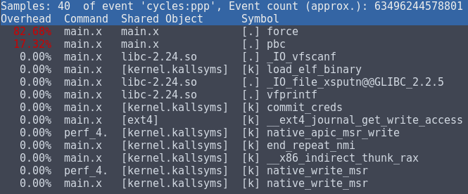

### Collaborative project on MD code optimization (Group 4) 

##### Team members: Alberto Cazzaniga, Celia Laurent, Antonio Sciarappa, Miguel Castellano.

#### 1. Introduction

For this project, we're given a simplified code to run molecular dynamics simulations in C and the goal is to implement a python interface along with a series of optimizations including parallelization schemes for MPI and OpenMP in a collaborative way, using continuous integration. 

#### 2. Work

The work developed during the project can be split in two parts: The realization of a Python interface in charge of calling the time-critical functions from C and the implementation of a bunch of optimizations to speed up the code plus the addition of both an MPI and OpenMP parallelization schemes aimed at providing a certain sense of scalability. 

For the first part, we wrote a python script that acted as an interface to the C code by implementing the same C functions in Python and calling only the time-critical functions from C by making use of ctypes and shared library handles.

For the second part, distributed memory parallelization was added by means of MPI directives into the code while shared memory multi-threading was enabled in a peculiar, more performant but also more memory consuming way using OpenMP pragmas. As for the optimizations, we implemented the in-lining of frequently called functions, re-formulation of expensive mathematical operations, vectorization and others.

#### 4. Optimization


We follow the optimisation strategies suggested. We briefly comment the results obtained in the various phases. All the profiling has been run on a Intel(R) Core(TM) i7-7500U CPU @ 2.70GHz machine, with dual core and hyperthreading disabled.

##### Choice of optimization flags

COMPILATION FLAGS: flag -O0 

*2916 atoms*

```
 Performance counter stats for '../main.x':

     433871.496417      task-clock (msec)         #    1.000 CPUs utilized          
               974      context-switches          #    0.002 K/sec                  
                 0      cpu-migrations            #    0.000 K/sec                  
               116      page-faults               #    0.000 K/sec                  
 1,176,366,484,257      cycles                    #    2.711 GHz                    
 1,950,828,589,891      instructions              #    1.66  insn per cycle         
   289,550,927,463      branches                  #  667.366 M/sec                  
     5,500,650,759      branch-misses             #    1.90% of all branches        

     433.942273773 seconds time elapsed
```

*108 atoms*



COMPILATION FLAGS: flag -O3 

*2916 atoms*

```
 Performance counter stats for '../main.x':

     278984.438294      task-clock (msec)         #    0.999 CPUs utilized          
             2,963      context-switches          #    0.011 K/sec                  
                 6      cpu-migrations            #    0.000 K/sec                  
               117      page-faults               #    0.000 K/sec                  
   757,179,241,778      cycles                    #    2.714 GHz                    
 1,163,915,527,983      instructions              #    1.54  insn per cycle         
   212,975,057,562      branches                  #  763.394 M/sec                  
     5,534,779,899      branch-misses             #    2.60% of all branches        

     279.137268749 seconds time elapsed
```

*108 atoms*



COMPILATION FLAGS: flags -O3 -fast-math 

*2916 atoms*

```
 Performance counter stats for '../main.x':

     142066.105954      task-clock (msec)         #    1.000 CPUs utilized          
             1,532      context-switches          #    0.011 K/sec                  
                 1      cpu-migrations            #    0.000 K/sec                  
               111      page-faults               #    0.001 K/sec                  
   395,643,227,013      cycles                    #    2.785 GHz                    
   573,591,518,431      instructions              #    1.45  insn per cycle         
   134,624,266,700      branches                  #  947.617 M/sec                  
     5,047,908,206      branch-misses             #    3.75% of all branches        

     142.095114883 seconds time elapsed
```

*108 atoms*



COMPILATION FLAGS: flags -O3 -fast-math -fexpensive-optimizations -msse3 

*2916 atoms*

```
 Performance counter stats for '../main.x':

     146215.400008      task-clock (msec)         #    1.000 CPUs utilized          
               352      context-switches          #    0.002 K/sec                  
                 1      cpu-migrations            #    0.000 K/sec                  
               111      page-faults               #    0.001 K/sec                  
   395,023,649,053      cycles                    #    2.702 GHz                    
   573,520,577,101      instructions              #    1.45  insn per cycle         
   134,610,546,999      branches                  #  920.632 M/sec                  
     5,048,645,224      branch-misses             #    3.75% of all branches        

     146.265948840 seconds time elapsed
```

- Total improvement via compilation flags: **3x speedup**
- After a quick benchmark we thus drop the flag -fexpensive-optimization
- In general instruction per cycle decrease or stay constant but increase in performance as better optimized set of instructions.

##### Inlining

INLINING, flags -O3 -ffast-math 

*2916 atoms*

```
 Performance counter stats for '../main.x':

     107131.233277      task-clock (msec)         #    0.999 CPUs utilized          
               361      context-switches          #    0.003 K/sec                  
                 0      cpu-migrations            #    0.000 K/sec                  
               113      page-faults               #    0.001 K/sec                  
   289,440,674,432      cycles                    #    2.702 GHz                    
   415,649,532,734      instructions              #    1.44  insn per cycle         
    83,548,308,780      branches                  #  779.869 M/sec                  
     4,988,981,154      branch-misses             #    5.97% of all branches        

     107.204632344 seconds time elapsed
```

*108 atoms*


- inlined function ```pbc``` by moving directly code to ```force.c``` file containing force computation, adding ```static inline __attribute__((always_inline))``` intrinsic.
- inlining is clearly succesful from perf output.
- reach **x4 speedup**.

##### Newton optimization

NEWTON, flags -O3 -ffast-math 

*2916 atoms*

```
 Performance counter stats for '../main.x':

      41109.016353      task-clock (msec)         #    0.998 CPUs utilized          
               345      context-switches          #    0.008 K/sec                  
                 3      cpu-migrations            #    0.000 K/sec                  
               113      page-faults               #    0.003 K/sec                  
   129,811,329,619      cycles                    #    3.158 GHz                    
   186,924,585,321      instructions              #    1.44  insn per cycle         
    37,786,495,566      branches                  #  919.178 M/sec                  
     2,270,430,631      branch-misses             #    6.01% of all branches        

      41.175206592 seconds time elapsed
```

*108 atoms*


- reached **x10 speedup**.
- From now on leave coarse grain perf description. At this stage only concentrate on force to obtain further speedup.


##### Reduce math operations

REDUCE MATH, flags -O3 -ffast-math (2916 atoms) 

```
 Performance counter stats for '../main.x':

      37065.530900      task-clock (msec)         #    0.999 CPUs utilized          
               414      context-switches          #    0.011 K/sec                  
                 0      cpu-migrations            #    0.000 K/sec                  
               111      page-faults               #    0.003 K/sec                  
   123,696,434,839      cycles                    #    3.337 GHz                    
   179,980,425,327      instructions              #    1.46  insn per cycle         
    37,783,649,722      branches                  # 1019.374 M/sec                  
     2,295,663,086      branch-misses             #    6.08% of all branches        

      37.093193418 seconds time elapsed
```

- Avoid use of powers, sqrt and divisions.

- Improvement can be seen in aasembly of perf output.

- reach **x11.6 speedup**.

  ****

**After OMP pragma instruction and code adaptation** (run with no -fopenp flag)

BEFORE LAST OPTIMIZATION LAYER 

*2916 atoms*

```
Evolve time: 35.109601

 Performance counter stats for '../main.x':

      35581.172046      task-clock (msec)         #    0.999 CPUs utilized          
               185      context-switches          #    0.005 K/sec                  
                 5      cpu-migrations            #    0.000 K/sec                  
               113      page-faults               #    0.003 K/sec                  
   124,187,773,089      cycles                    #    3.490 GHz                    
   147,673,667,736      instructions              #    1.19  insn per cycle
       127,453,310      cache-references                                            
         8,434,924      cache-misses              #    6.618 % of all cache refs  
    37,782,300,161      branches                  # 1061.862 M/sec                  
     2,260,307,183      branch-misses             #    5.98% of all branches        

      35.603604495 seconds time elapsed

```

BEFORE LAST OPTIMIZATION LAYER 

*108 atoms*

```
Evolve time: 1.100160

Performance counter stats for '../main.x':

       1121.006401      task-clock (msec)         #    0.999 CPUs utilized          
                 9      context-switches          #    0.008 K/sec                  
                 0      cpu-migrations            #    0.000 K/sec                  
                64      page-faults               #    0.057 K/sec                  
     3,818,553,519      cycles                    #    3.406 GHz                    
     2,960,165,769      instructions              #    0.78  insn per cycle
         1,724,978      cache-references                                            
           910,551      cache-misses              #   52.786 % of all cache refs 
       560,551,149      branches                  #  500.043 M/sec                  
        87,191,783      branch-misses             #   15.55% of all branches        

       1.122353338 seconds time elapsed

```

- adapted our optimizations to the openmpi layer. Unexpectedly get a further speedup given reducing number of instructions. 
- reached **x12.1 speedup**

##### Last optimization

We try to improve possibilities of having vectorization and make use of spatial locality by creating two temporary buffers (one for positions R and one for forces F) inside the force function, see files ```force.c``` and ```force_mpi.c``` in ```ljmd-c/src/new``` forlder. Further improvement could be given by changing the all data structure sys, but due to time constraint we leave this for future work.

AFTER LAST OPTIMIZATION LAYER 

*108 atoms*

```
Evolve time: 1.081362

Performance counter stats for '../main.x':

       1099.120589      task-clock (msec)         #    0.999 CPUs utilized          
                 8      context-switches          #    0.007 K/sec                  
                 1      cpu-migrations            #    0.001 K/sec                  
            12,798      page-faults               #    0.012 M/sec                  
     3,739,226,030      cycles                    #    3.402 GHz                    
     2,629,548,032      instructions              #    0.70  insn per cycle         
         4,951,491      cache-references                                            
         2,514,690      cache-misses              #   50.787 % of all cache refs
       568,839,950      branches                  #  517.541 M/sec                  
        90,690,447      branch-misses             #   15.94% of all branches        

       1.100490502 seconds time elapsed

```


AFTER LAST OPTIMIZATION LAYER 

*2916 atoms*

```
Evolve time: 31.132160

 Performance counter stats for '../main.x':

      31624.351582      task-clock (msec)         #    1.000 CPUs utilized          
                55      context-switches          #    0.002 K/sec                  
                 2      cpu-migrations            #    0.000 K/sec                  
            34,327      page-faults               #    0.001 M/sec                  
   110,329,150,159      cycles                    #    3.489 GHz                    
   121,692,644,085      instructions              #    1.10  insn per cycle
       109,657,647      cache-references                                            
        13,907,178      cache-misses              #   12.682 % of all cache refs
    37,802,268,600      branches                  # 1195.353 M/sec                  
     2,328,234,384      branch-misses             #    6.16% of all branches        

      31.627499914 seconds time elapsed

```

- reduce further the number of instructions. Slightly lower instruction per cycle but still a good value.
- we reach a **x13.7 speedup**.

##### OMP compatibility of last optimisation

BEFORE LAST OPT, with OMP_NUM_THREADS=2

(Hyperthreading disabled on my machine less performance)

```
Evolve time: 19.977002
Simulation Done.

 Performance counter stats for '../main.x':

      40083.017528      task-clock (msec)         #    1.953 CPUs utilized          
             2,683      context-switches          #    0.067 K/sec                  
                 1      cpu-migrations            #    0.000 K/sec                  
               148      page-faults               #    0.004 K/sec                  
   128,850,228,838      cycles                    #    3.215 GHz                    
   147,977,660,258      instructions              #    1.15  insn per cycle
        77,857,770      cache-references                                            
        12,095,369      cache-misses              #   15.535 % of all cache refs 
    37,860,212,003      branches                  #  944.545 M/sec                  
     2,272,772,703      branch-misses             #    6.00% of all branches        

      20.526552651 seconds time elapsed


```

- reach **x21.1 speedup**  with **two cores** before last optimisation.

AFTER LAST OPT. OMP_NUM_THREADS=2

(Hyperthreading disabled on my machine less performance)

```
Evolve time: 17.026178
Simulation Done.

 Performance counter stats for '../main.x':

      34135.812936      task-clock (msec)         #    1.944 CPUs utilized          
             3,384      context-switches          #    0.099 K/sec                  
                 3      cpu-migrations            #    0.000 K/sec                  
            52,280      page-faults               #    0.002 M/sec                  
   118,627,998,083      cycles                    #    3.475 GHz                    
   134,784,564,238      instructions              #    1.14  insn per cycle 
       100,175,745      cache-references                                            
        17,937,006      cache-misses              #   17.906 % of all cache refs
    37,879,590,001      branches                  # 1109.673 M/sec                  
     2,388,623,352      branch-misses             #    6.31% of all branches        

      17.556866156 seconds time elapsed
```

- reach **x24.7 speedup** with **two cores** with respect to initial code after last optimisation.

##### MPI compatibility of last optimisation

MPI COMPATIBILITY (2916 atoms): BEFORE LAST OPT. MPI_NUM_PROC=2

(Hyperthreading disabled on my machine less performance)

NOTE: instrumented c file ```main_mpi.c``` for measuring force function.

```
Time process 1: 20.921596
Time process 0: 20.428976
Evolve time: 20.921596
```

- reach **x20.7 speedup** with **two MPI processes** with respect to initial code before last optimisation.

MPI COMPATIBILITY (2916 atoms): MPI_NUM_PROC=2

(Hyperthreading disabled on my machine less performance)

```
Time process 1: 18.457735
Time process 0: 17.993986
Evolve time: 18.457735
```

- reach **x23.5 speedup** with **two MPI processes** with respect to initial code.

